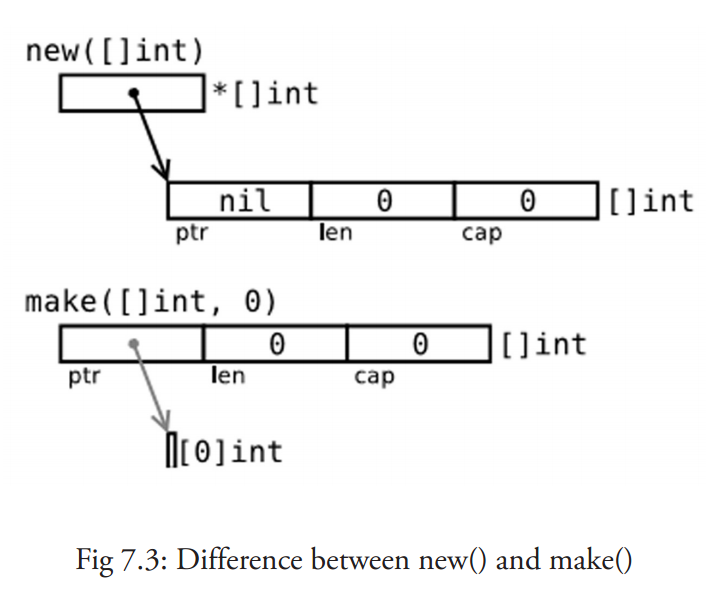
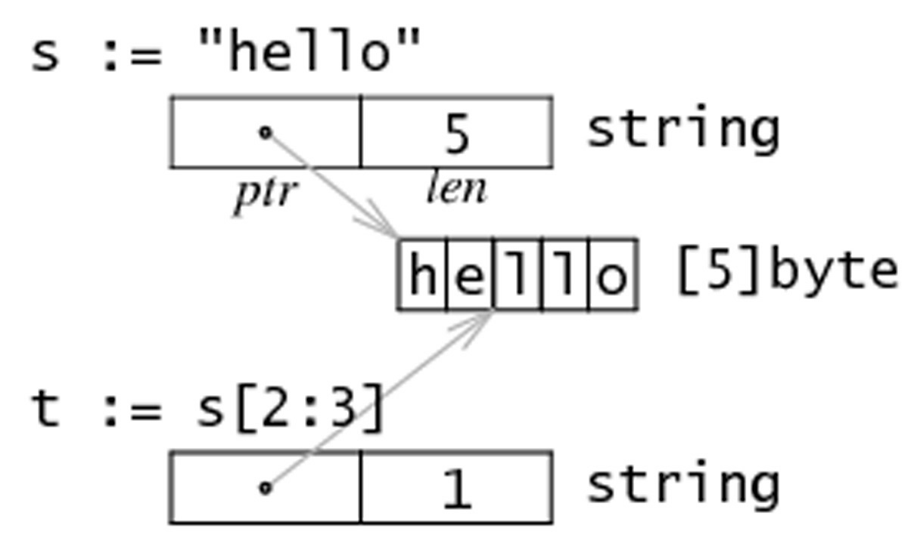

## 数组与切片

- 集合，它是可以包含大量条目 (item) 的数据结构，例如数组、切片和 map。从这看到 Go 明显受到 Python 的影响。
- 以 [] 符号标识的数组类型几乎在所有的编程语言中都是一个基本主力。Go 语言中的数组也是类似的，只是有一些特点。
- Go 没有 C 那么灵活，但是拥有切片 (slice) 类型。这是一种建立在 Go 语言数组类型之上的抽象，要想理解切片我们必须先理解数组。
- 数组有特定的用处，但是却有一些呆板，所以在 Go 语言的代码里并不是特别常见。相对的，切片确实随处可见的。它们构建在数组之上并且提供更强大的能力和便捷。

1. 声明和初始化

   1. 概念
      - 数组是具有相同 唯一类型 的一组已编号且长度固定的数据项序列（这是一种同构的数据结构）。
      - 这种类型可以是任意的原始类型例如整型、字符串或者自定义类型。
      - 数组长度必须是一个常量表达式，并且必须是一个非负整数。数组长度也是数组类型的一部分，所以 [5]int 和 [10]int 是属于不同类型的。
      - 数组的编译时值初始化是按照数组顺序完成的。
      - 想让数组元素类型为任意类型的话可以使用空接口作为类型。当使用值时我们必须先做一个类型判断。
      - 数组元素可以通过 索引（位置）来读取（或者修改），索引从 0 开始，第一个元素索引为 0，第二个索引为 1，以此类推（数组以 0 开始在所有类 C 语言中是相似的）。元素的数目（也称为长度或者数组大小）必须是固定的并且在声明该数组时就给出（编译时需要知道数组长度以便分配内存）；数组长度最大为 2GB。
      - 声明的格式：`var identifier [len]type`。
      - 对索引项为 i 的数组元素赋值可以这么操作：`arr[i] = value`，所以数组是 可变的。
      - 只有有效的索引可以被使用，当使用等于或者大于 len(arr1) 的索引时：如果编译器可以检测到，会给出索引超限的提示信息；如果检测不到的话编译会通过而运行时会 panic()。
      - 由于索引的存在，遍历数组的方法自然就是使用 for 结构：
        - 通过 for 初始化数组项
        - 通过 for 打印数组元素
        - 通过 for 依次处理元素
      ```
         for i:=0; i < len(arr1); i++｛
           arr1[i] = ...
         }
      ```
      ```
        for i,_:= range arr1 {
        ...
        }
      ```
      - Go 语言中的数组是一种 值类型（不像 C/C++ 中是指向首元素的指针），所以可以通过 new() 来创建：`var arr1 = new([5]int)`。这种方式和 `var arr2 [5]int` 的区别是什么呢？arr1 的类型是 `*[5]int`，而 arr2 的类型是 `[5]int`。
   2. 数组常量
      - 如果数组值已经提前知道了，那么可以通过 数组常量 的方法来初始化数组，而不用依次使用 `[]=` 方法（所有的组成元素都有相同的常量语法）。
        ```
          var arrKeyValue = [5]string{3: "Chris", 4: "Ron"}
        ```
      - 第一种：`var arrAge = [10]int {1, 2, 3}`，这是一个有 10 个元素的数组，除了前三个元素外其他元素都为 0。
      - 第二种：`var arrLazy = [...]int{5, 6, 7, 8, 22}`，... 同样可以忽略，从技术上说它们其实变成了切片。
      - 第三种：key: value 语法，`var arrKeyValue = [5]string{3: "Chris", 4: "Ron"}`。
      - 可以取任意数组常量的地址来作为指向新实例的指针。
        ```
          func fp(a *[3]int) { fmt.Println(a) }
          func main() {
            for i := 0; i < 3; i++ {
              fp(&[3]int{i, i * i, i * i * i})
            }
          }
        ```
      - 几何点（或者数学向量）是一个使用数组的经典例子。为了简化代码通常使用一个别名：
        ```
          type Vector3D [3]float32
          var vec Vector3D
        ```
   3. 多维数组

      - 数组通常是一维的，但是可以用来组装成多维数组，例如：`[3][5]int`，`[2][2][2]float64`。
      - 内部数组总是长度相同的。Go 语言的多维数组是矩形式的，唯一的例外是切片的数组。

        ```
          const (
            WIDTH  = 1920
            HEIGHT = 1080
          )

          var screen [WIDTH][HEIGHT]int

          for i := 0; i < HEIGHT; i++ {
            for j := 0; j < WIDTH; j++ {
              screen[j][i] = 0
            }
          }
        ```

   4. 将数组传递给函数
      - 把一个大数组传递给函数会消耗很多内存。有两种方法可以避免这种情况：
        - 传递数组的指针
        - 使用数组的切片

2. 切片

   - 概念
     - 切片 (slice) 是对数组一个连续片段的引用（该数组我们称之为相关数组，通常是匿名的），所以切片是一个引用类型（因此更类似于 C/C++ 中的数组类型，或者 Python 中的 list 类型）。这个片段可以是整个数组，或者是由起始和终止索引标识的一些项的子集。需要注意的是，终止索引标识的项不包括在切片内。切片提供了一个相关数组的动态窗口。
     - 切片是可索引的，并且可以由 `len()` 函数获取长度。
     - 给定项的切片索引可能比相关数组的相同元素的索引小。和数组不同的是，切片的长度可以在运行时修改，最小为 0， 最大为相关数组的长度：切片是一个 长度可变的数组。
     - 切片提供了计算容量的函数 `cap()` 可以测量切片最长可以达到多少：它等于切片的长度 + 数组除切片之外的长度。如果 s 是一个切片，`cap(s)` 就是从 `s[0]` 到数组末尾的数组长度。切片的长度永远不会超过它的容量，所以对于切片 s 来说该不等式永远成立：`0 <= len(s) <= cap(s)`。
     - 多个切片如果表示同一个数组的片段，它们可以共享数据；因此一个切片和相关数组的其他切片是共享存储的，相反，不同的数组总是代表不同的存储。数组实际上是切片的构建块。
     - 优点 因为切片是引用，所以它们不需要使用额外的内存并且比使用数组更有效率，所以在 Go 代码中切片比数组更常用。
     - 声明切片的格式是： `var identifier []type`（不需要说明长度）。一个切片在未初始化之前默认为 nil，长度为 0。
     - 切片的初始化格式是：`var slice1 []type = arr1[start:end]`。
       - 这表示 slice1 是由数组 arr1 从 start 索引到 end-1 索引之间的元素构成的子集（切分数组，start:end 被称为切片表达式）。所以 `slice1[0]` 就等于 `arr1[start]`。这可以在 arr1 被填充前就定义好。
       - `var slice1 []type = arr1[:]` 那么 slice1 就等于完整的 arr1 数组（所以这种表示方式是 `arr1[0:len(arr1)]` 的一种缩写）。另外一种表述方式是：`slice1 = &arr1`。
       - `arr1[2:]` 和 `arr1[2:len(arr1)]` 相同，都包含了数组从第三个到最后的所有元素。
       - `arr1[:3]` 和 `arr1[0:3]` 相同，包含了从第一个到第三个元素（不包括第四个）。
       - 如果想去掉 slice1 的最后一个元素，只要 `slice1 = slice1[:len(slice1)-1]`。
     - 用切片组成的切片，拥有相同的元素，仍然指向相同的相关数组。
     - 一个切片 s 可以这样扩展到它的大小上限：`s = s[:cap(s)]`，如果再扩大的话就会导致运行时错误。
     - 对于每一个切片（包括 string），以下状态总是成立的：
       ```
         s == s[:i] + s[i:] // i是一个整数且: 0 <= i <= len(s)
         len(s) <= cap(s)
       ```
     - 切片也可以用类似数组的方式初始化：`var x = []int{2, 3, 5, 7, 11}`。这样就创建了一个长度为 5 的数组并且创建了一个相关切片。
     - 切片在内存中的组织方式实际上是一个有 3 个域的结构体：指向相关数组的指针，切片长度以及切片容量。
     - 如果 s2 是一个切片，可以将 s2 向后移动一位 `s2 = s2[1:]`，但是末尾没有移动。切片只能向后移动，`s2 = s2[-1:]` 会导致编译错误。切片不能被重新分片以获取数组的前一个元素。
     - 注意 绝对不要用指针指向切片。切片本身已经是一个引用类型，所以它本身就是一个指针！！。
   - 将切片传递给函数

     - 如果有一个函数需要对数组做操作，可能总是需要把参数声明为切片。当调用该函数时，把数组分片，创建为一个切片引用并传递给该函数。这里有一个计算数组元素和的方法:

       ```
         func sum(a []int) int {
           s := 0
           for i := 0; i < len(a); i++ {
             s += a[i]
           }
           return s
         }

         func main() {
           var arr = [5]int{0, 1, 2, 3, 4}
           sum(arr[:])
         }
       ```

   - 用 make() 创建一个切片
     - 当相关数组还没有定义时，我们可以使用 `make()` 函数来创建一个切片，同时创建好相关数组：`var slice1 []type = make([]type, len)`。也可以简写为 `slice1 := make([]type, len)`，这里 len 是数组的长度并且也是 slice 的初始长度。
     - `make()` 接受 2 个参数：元素的类型以及切片的元素个数。
     - `make()` 的使用方式是：`func make([]T, len, cap)`，其中 cap 是可选参数。
     - 下面两种方法可以生成相同的切片:
       ```
         make([]int, 50, 100)
         new([100]int)[0:50]
       ```
     - 因为字符串是纯粹不可变的字节数组，它们也可以被切分成切片。
   - new() 和 make() 的区别
     - 看起来二者没有什么区别，都在堆上分配内存，但是它们的行为不同，适用于不同的类型。
       - `new(T)` 为每个新的类型 T 分配一片内存，初始化为 0 并且返回类型为 \*T 的内存地址：这种方法 返回一个指向类型为 T，值为 0 的地址的指针，它适用于值类型如数组和结构体；它相当于 &T{}。
       - `make(T)` 返回一个类型为 T 的初始值，它只适用于 3 种内建的引用类型：切片、map 和 channel。
     - 换言之，`new()` 函数分配内存，`make()` 函数初始化；下图给出了区别：
       
     - 如何理解 new、make、slice、map、channel 的关系
       - slice、map 以及 channel 都是 golang 内建的一种引用类型，三者在内存中存在多个组成部分， 需要对内存组成部分初始化后才能使用，而 make 就是对三者进行初始化的一种操作方式
       - new 获取的是存储指定变量内存地址的一个变量，对于变量内部结构并不会执行相应的初始化操作， 所以 slice、map、channel 需要 make 进行初始化并获取对应的内存地址，而非 new 简单的获取内存地址
   - 多维切片
     - 和数组一样，切片通常也是一维的，但是也可以由一维组合成高维。通过分片的分片（或者切片的数组），长度可以任意动态变化，所以 Go 语言的多维切片可以任意切分。而且，内层的切片必须单独分配（通过 `make()` 函数）。
   - bytes 包

     - 类型 `[]byte` 的切片十分常见，Go 语言有一个 bytes 包专门用来提供这种类型的操作方法。
     - bytes 包和字符串包十分类似。而且它还包含一个十分有用的类型 Buffer:

       ```
         import "bytes"

         type Buffer struct {
           ...
         }
       ```

     - 这是一个长度可变的 bytes 的 buffer，提供 `Read()` 和 `Write()` 方法，因为读写长度未知的 bytes 最好使用 buffer。
     - Buffer 定义方法：
       - 这样定义：`var buffer bytes.Buffer`。
       - 使用 `new()` 获得一个指针：`var r *bytes.Buffer = new(bytes.Buffer)`。
       - 通过函数：`func NewBuffer(buf []byte) *Buffer`，创建一个 Buffer 对象并且用 buf 初始化好；NewBuffer 最好用在从 buf 读取的时候使用。
     - 通过 buffer 串联字符串

       - 创建一个 buffer，通过 buffer.WriteString(s) 方法将字符串 s 追加到后面，最后再通过 buffer.String() 方法转换为 string

       ```
          var buffer bytes.Buffer
          for i := 0; i < 10; i++ {
            buffer.WriteString(fmt.Sprint(i))
          }
          fmt.Print(buffer.String())
       ```

       - 实现方式比使用 += 要更节省内存和 CPU，尤其是要串联的字符串数目特别多的时候。

3. For-range 结构

   - 这种构建方法可以应用于数组和切片，第一个返回值 ix 是数组或者切片的索引，第二个是在该索引位置的值；他们都是仅在 for 循环内部可见的局部变量。value 只是 slice1 某个索引位置的值的一个拷贝，不能用来修改 slice1 该索引位置的值。
     ```
       for ix, value := range slice1 {
         ...
       }
     ```
   - 如果只需要索引，可以忽略第二个变量。
   - 多维切片下的 for-range：
     - 通过计算行数和矩阵值可以很方便的写出 for 循环来，例如：
       ```
         for row := range screen {
           for column := range screen[row] {
             screen[row][column] = 1
           }
         }
       ```

4. 切片重组（reslice）

   - 切片创建的时候通常比相关数组小，例如：`slice1 := make([]type, start_length, capacity)`，其中 start_length 作为切片初始长度而 capacity 作为相关数组的长度。
   - 改变切片长度的过程称之为切片重组 reslicing，做法如下：`slice1 = slice1[0:end]`，其中 end 是新的末尾索引（即长度）。
   - 将切片扩展 1 位可以这么做：`sl = sl[0:len(sl)+1]`，切片可以反复扩展直到占据整个相关数组。

5. 切片的复制与追加

   - 如果想增加切片的容量，必须创建一个新的更大的切片并把原分片的内容都拷贝过来。从拷贝切片的 copy 函数和向切片追加新元素的 `append()` 函数。
   - `func append(s[]T, x ...T) []T` 其中 `append()` 方法将 0 个或多个具有相同类型 s 的元素追加到切片后面并且返回新的切片；追加的元素必须和原切片的元素是同类型。如果 s 的容量不足以存储新增元素， `append()` 会分配新的切片来保证已有切片元素和新增元素的存储。因此，返回的切片可能已经指向一个不同的相关数组了。`append()` 方法总是返回成功，除非系统内存耗尽了。
     - 如果你想将切片 y 追加到切片 x 后面，只要将第二个参数扩展成一个列表即可：`x = append(x, y...)`。
     - append() 在大多数情况下很好用，但是如果你想完全掌控整个追加过程，你可以实现一个这样的 AppendByte() 方法：
       ```
         func AppendByte(slice []byte, data ...byte) []byte {
           m := len(slice)
           n := m + len(data)
           if n > cap(slice) { // if necessary, reallocate
             // allocate double what's needed, for future growth.
             newSlice := make([]byte, (n+1)*2)
             copy(newSlice, slice)
             slice = newSlice
           }
           slice = slice[0:n]
           copy(slice[m:n], data)
           return slice
         }
       ```
   - `func copy(dst, src []T) int` 方法将类型为 T 的切片从源地址 src 拷贝到目标地址 dst，覆盖 dst 的相关元素，并且返回拷贝的元素个数。源地址和目标地址可能会有重叠。拷贝个数是 src 和 dst 的长度最小值。如果 src 是字符串那么元素类型就是 byte。如果你还想继续使用 src，在拷贝结束后执行 src = dst。

6. 字符串、数组和切片的应用
   1. 从字符串生成字节切片
      - 假设 s 是一个字符串（本质上是一个字节数组），那么就可以直接通过 `c := []byte(s)` 来获取一个字节的切片 c 。
      - 还可以通过 `copy()` 函数来达到相同的目的：`copy(dst []byte, src string)`。
      - 还可以使用 for-range 来获得每个元素。
      - Unicode 字符会占用 2 个字节，有些甚至需要 3 个或者 4 个字节来进行表示。
      - 如果发现错误的 UTF8 字符，则该字符会被设置为 U+FFFD 并且索引向前移动一个字节。
      - 和字符串转换一样，同样可以使用 `c := []int32(s)` 语法，这样切片中的每个 int 都会包含对应的 Unicode 代码，因为字符串中的每次字符都会对应一个整数。
      - 类似的，也可以将字符串转换为元素类型为 rune 的切片：`r := []rune(s)`。
      - 可以通过代码 `len([]int32(s))` 来获得字符串中字符的数量，但使用 `utf8.RuneCountInString(s)` 效率会更高一点。
      - 还可以将一个字符串追加到某一个字节切片的尾部：`append([]byte, s...)`
   2. 获取字符串的某一部分
      - 使用 `substr := str[start:end]` 可以从字符串 str 获取到从索引 start 开始到 end-1 位置的子字符串。
      - 同样的，`str[start:]` 则表示获取从 start 开始到 `len(str)-1` 位置的子字符串。而 `str[:end]` 表示获取从 0 开始到 end-1 的子字符串。
   3. 字符串和切片的内存结构
      - 在内存中，一个字符串实际上是一个双字结构，即一个指向实际数据的指针和记录字符串长度的整数。
      - 因为指针对用户来说是完全不可见，因此可以依旧把字符串看做是一个值类型，也就是一个字符数组。
      - 字符串 `string s = "hello"` 和子字符串 `t = s[2:3]` 在内存中的结构可以用下图表示：
        
