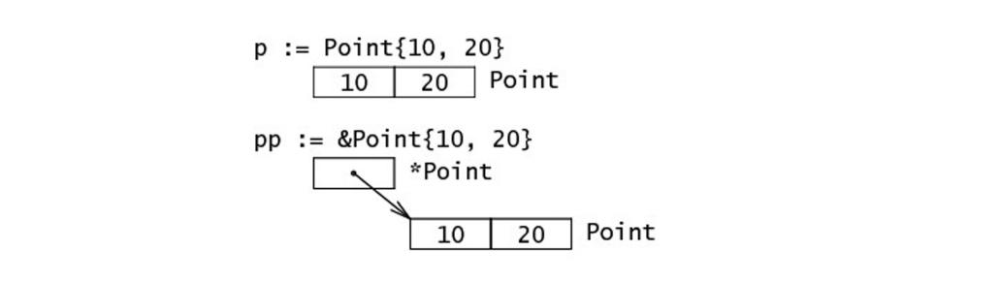
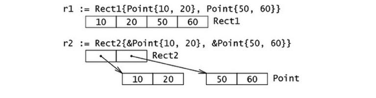
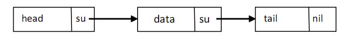

## 结构 (struct) 与方法 (method)

- Go 通过类型别名 (alias types) 和结构体的形式支持用户自定义类型，或者叫定制类型。
- 一个带属性的结构体试图表示一个现实世界中的实体。
- 结构体是复合类型 (composite types)，当需要定义一个类型，它由一系列属性组成，每个属性都有自己的类型和值的时候，就应该使用结构体，它把数据聚集在一起。然后可以访问这些数据，就好像它是一个独立实体的一部分。结构体也是值类型，因此可以通过 new 函数来创建。
- 组成结构体类型的那些数据称为 字段 (fields)。每个字段都有一个类型和一个名字；在一个结构体中，字段名字必须是唯一的。
- 结构体的概念在软件工程上旧的术语叫 ADT（抽象数据类型：Abstract Data Type），在一些老的编程语言中叫 记录 (Record)，比如 Cobol，在 C 家族的编程语言中它也存在，并且名字也是 struct，在面向对象的编程语言中，跟一个无方法的轻量级类一样。不过因为 Go 语言中没有类的概念，因此在 Go 中结构体有着更为重要的地位。

1. 结构体定义

   - 结构体定义的一般方式如下：
     ```
       type identifier struct {
          field1 type1
          field2 type2
          ...
       }
     ```
   - `type T struct {a, b int}` 也是合法的语法，它更适用于简单的结构体。
   - 结构体里的字段都有 名字，像 `field1、field2` 等，如果字段在代码中从来也不会被用到，那么可以命名它为 \_。
   - 结构体的字段可以是任何类型，甚至是结构体本身，也可以是函数或者接口。可以声明结构体类型的一个变量，然后像下面这样给它的字段赋值：
     ```
       var s T
       s.a = 5
       s.b = 8
     ```
   - 数组可以看作是一种结构体类型，不过它使用下标而不是具名的字段。
   - 使用 `new()`
     - 使用 `new()` 函数给一个新的结构体变量分配内存，它返回指向已分配内存的指针：`var t *T = new(T)`，如果需要可以把这条语句放在不同的行（比如定义是包范围的，但是分配却没有必要在开始就做）。
     - 写这条语句的惯用方法是：`t := new(T)`，变量 t 是一个指向 T 的指针，此时结构体字段的值是它们所属类型的零值。
     - 声明 `var t T` 也会给 t 分配内存，并零值化内存，但是这个时候 t 是类型 T 。在这两种方式中，t 通常被称做类型 T 的一个实例 (instance) 或对象 (object)。
     - 就像在面向对象语言所作的那样，可以使用点号符给字段赋值：`structname.fieldname = value`。
     - 同样的，使用点号符可以获取结构体字段的值：`structname.fieldname`。
     - 在 Go 语言中这叫 选择器 (selector)。无论变量是一个结构体类型还是一个结构体类型指针，都使用同样的 选择器符 (selector-notation) 来引用结构体的字段
     - 初始化一个结构体实例（一个结构体字面量：struct-literal）的更简短和惯用的方式如下：` ms := &struct1{10, 15.5, "Chris"}`，或者：`var ms struct1; ms = struct1{10, 15.5, "Chris"}`。
     - 混合字面量语法 (composite literal syntax) `&struct1{a, b, c}` 是一种简写，底层仍然会调用 `new()`，这里值的顺序必须按照字段顺序来写。表达式 `new(Type)` 和 `&Type{}` 是等价的。
     - 结构体类型和字段的命名遵循可见性规则，一个导出的结构体类型中有些字段是导出的，另一些不是，这是可能的。
     - 下图说明了结构体类型实例和一个指向它的指针的内存布局：`type Point struct { x, y int }`
       - 使用 new() 初始化：
         
       - 作为结构体字面量初始化：
         
   - 结构体的内存布局
     - Go 语言中，结构体和它所包含的数据在内存中是以连续块的形式存在的，即使结构体中嵌套有其他的结构体，这在性能上带来了很大的优势。
     - Go 语言中的指针：
       ```
         type Rect1 struct {Min, Max Point }
         type Rect2 struct {Min, Max *Point }
       ```
       
     - 递归结构体，结构体类型可以通过引用自身来定义。这在定义链表或二叉树的元素（通常叫节点）时特别有用，此时节点包含指向临近节点的链接（地址）。
       - 链表
         
         - Go 代码：
           ```
             type Node struct {
               data    float64
               su      *Node
             }
           ```
         - 链表中的第一个元素叫 head，它指向第二个元素；最后一个元素叫 tail，它没有后继元素，所以它的 su 为 nil 值。当然真实的链接会有很多数据节点，并且链表可以动态增长或收缩。
         - 可以定义一个双向链表，它有一个前趋节点 pr 和一个后继节点 su：
           ```
             type Node struct {
               pr      *Node
               data    float64
               su      *Node
             }
           ```
       - 二叉树
         
         - 二叉树中每个节点最多能链接至两个节点：左节点 (le) 和右节点 (ri)，这两个节点本身又可以有左右节点，依次类推。树的顶层节点叫根节点 (root)，底层没有子节点的节点叫叶子节点 (leaves)，叶子节点的 le 和 ri 指针为 nil 值。
         ```
          type Tree struct {
            le      *Tree
            data    float64
            ri      *Tree
          }
         ```
     - 结构体转换
       - Go 中的类型转换遵循严格的规则。当为结构体定义了一个 alias 类型时，此结构体类型和它的 alias 类型都有相同的底层类型，同时需要注意其中非法赋值或转换引起的编译错误。

2. 使用工厂方法创建结构体实例

   1. 结构体工厂

      - Go 语言不支持面向对象编程语言中那样的构造子方法，但是可以很容易的在 Go 中实现 “构造子工厂”方法。
      - 为了方便通常会为类型定义一个工厂，按惯例，工厂的名字以 new... 或 New... 开头。假设定义了如下的 File 结构体类型：
        ```
          type File struct {
            fd      int     // 文件描述符
            name    string  // 文件名
          }
        ```
      - 下面是这个结构体类型对应的工厂方法，它返回一个指向结构体实例的指针：

        ```
          func NewFile(fd int, name string) *File {
            if fd < 0 {
                return nil
            }

            return &File{fd, name}
          }

          f := NewFile(10, "./test.txt")
        ```

      - 在 Go 语言中常常像上面这样在工厂方法里使用初始化来简便的实现构造函数。
      - 如果 File 是一个结构体类型，那么表达式 `new(File)` 和 `&File{}` 是等价的。
      - 如果想知道结构体类型 T 的一个实例占用了多少内存，可以使用：`size := unsafe.Sizeof(T{})`。
      - 如何强制使用工厂方法

        - 通过应用可见性规则就可以禁止使用 `new()` 函数，强制用户使用工厂方法，从而使类型变成私有的，就像在面向对象语言中那样。

          ```
            type matrix struct {
                ...
            }

            func NewMatrix(params) *matrix {
              m := new(matrix) // 初始化 m
              return m
            }
          ```

        - 在其他包里使用工厂方法：
          ```
            package main
            import "matrix"
            ...
            wrong := new(matrix.matrix)     // 编译失败（matrix 是私有的）
            right := matrix.NewMatrix(...)  // 实例化 matrix 的唯一方式
          ```

   2. map 和 struct vs new() 和 make()
      - 只能使用 `make()` 的三种类型：slices 、 maps 、 channels。
      - 试图 `make()` 一个结构体变量，会引发一个编译错误，这还不是太糟糕，但是 `new()` 一个 map 并试图向其填充数据，将会引发运行时错误！ 因为 `new(Foo)` 返回的是一个指向 nil 的指针，它尚未被分配内存。所以在使用 map 时要特别谨慎。

3. 带标签的结构体

   - 结构体中的字段除了有名字和类型外，还可以有一个可选的标签 (tag)：它是一个附属于字段的字符串，可以是文档或其他的重要标记。
   - 标签的内容不可以在一般的编程中使用，只有包 reflect 能获取它。

     ```
       type TagType struct { // tags
         field1 bool   "An important answer"
         field2 string "The name of the thing"
         field3 int    "How much there are"
       }

       func refTag(tt TagType, ix int) {
          ttType := reflect.TypeOf(tt)
          ixField := ttType.Field(ix)
          fmt.Printf("%v\n", ixField.Tag)
        }
     ```

4. 匿名字段和内嵌结构体

   1. 定义

      - 结构体可以包含一个或多个 匿名（或内嵌）字段，即这些字段没有显式的名字，只有字段的类型是必须的，此时类型就是字段的名字。
      - 匿名字段本身可以是一个结构体类型，即 结构体可以包含内嵌结构体。
      - 可以粗略地将这个和面向对象语言中的继承概念相比较，随后将会看到它被用来模拟类似继承的行为。Go 语言中的继承是通过内嵌或组合来实现的，所以可以说，在 Go 语言中，相比较于继承，组合更受青睐。

        ```
          type innerS struct {
            in1 int
            in2 int
          }

          type outerS struct {
            b    int
            c    float32
            int  // anonymous field
            innerS //anonymous field
          }
        ```

      - 通过类型 outer.int 的名字来获取存储在匿名字段中的数据，于是可以得出一个结论：在一个结构体中对于每一种数据类型只能有一个匿名字段。

   2. 内嵌结构体

      - 同样地结构体也是一种数据类型，所以它也可以作为一个匿名字段来使用，如同上面例子中那样。外层结构体通过 outer.in1 直接进入内层结构体的字段，内嵌结构体甚至可以来自其他包。内层结构体被简单的插入或者内嵌进外层结构体。这个简单的“继承”机制提供了一种方式，使得可以从另外一个或一些类型继承部分或全部实现。

   3. 命名冲突
      - 当两个字段拥有相同的名字（可能是继承来的名字）时该怎么办呢？
        - 外层名字会覆盖内层名字（但是两者的内存空间都保留），这提供了一种重载字段或方法的方式；
        - 如果相同的名字在同一级别出现了两次，如果这个名字被程序使用了，将会引发一个错误（不使用没关系）。没有办法来解决这种问题引起的二义性，必须由程序员自己修正。
